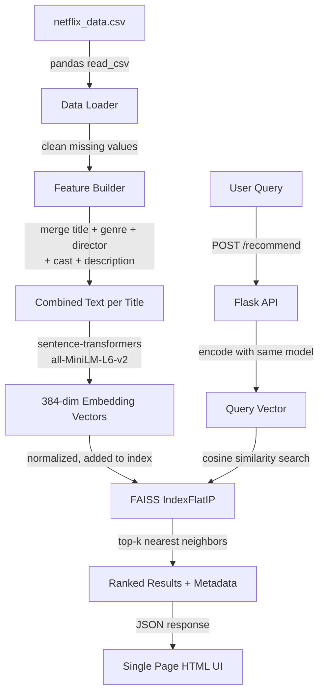
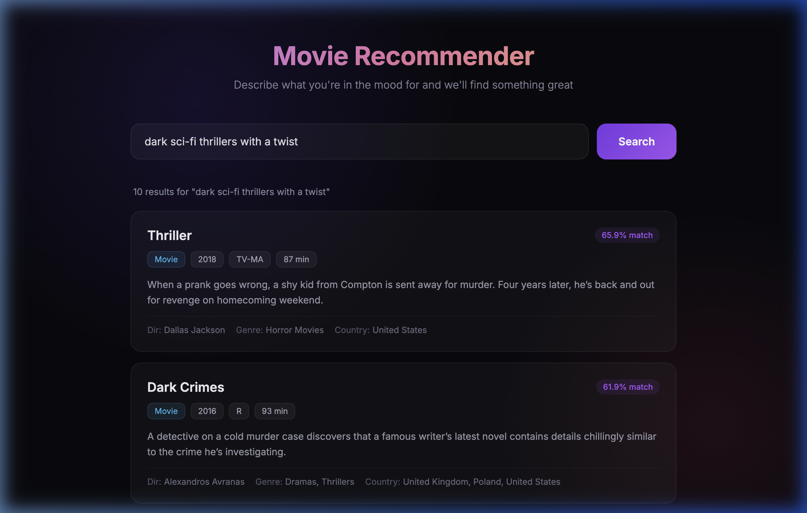

# Movie Recommendation System

A content-based movie recommender that takes natural language queries (like "funny 90s comedies" or "dark sci-fi thrillers") and returns the most relevant titles from a Netflix dataset of ~8,800 movies and TV shows.

Built for the Telo AI Co-Op assessment.

## How it works

The system works in two phases:

**Startup (one-time):** When the server boots, it reads `netflix_data.csv` and builds a combined text representation for each title by merging the title, genres, director, cast, country, rating, year, and description together. Then it runs all of these through a sentence-transformer model to get a 384-dimensional embedding vector for each one. These vectors get stored in a FAISS index for fast lookup.

**Query time:** When a user types something like "romantic comedies set in Paris", the query text gets embedded using the same model. FAISS then finds the 10 closest title vectors using cosine similarity, and those titles get sent back to the frontend ranked by how well they match.

The trick that makes this work well is that sentence-transformers understand *meaning*, not just keywords. So "something scary to watch at night" will match horror movies even though the word "horror" never appears in the query. It also picks up on things like tone, setting, and genre from the way things are phrased.

I weight certain fields more heavily in the combined text (title and genres get repeated) so the model pays more attention to them when computing the embedding. This makes genre-based queries ("action movies", "romantic dramas") work really well while still letting freeform stuff work too.

## Architecture



## AI Setup

| Detail | Value |
|--------|-------|
| Provider | Hugging Face / sentence-transformers (runs locally, no API needed) |
| Model | `all-MiniLM-L6-v2` |
| Embedding dim | 384 |
| Vector store | FAISS (faiss-cpu) |
| Similarity metric | Cosine similarity (via normalized inner product) |

No API keys are required. The model downloads automatically on first run (~80MB) and gets cached. Everything runs locally.

## Project Structure

```
.
├── app.py                 # flask server, serves UI and API
├── recommender.py         # core recommendation engine
├── netflix_data.csv       # the dataset
├── requirements.txt       # python dependencies
├── Dockerfile             # containerization
├── README.md              # you are here
└── templates/
    └── index.html         # the frontend
```

## Running with Docker

Build and run with exactly two commands:

```bash
docker build -t movie-recommender .
docker run -p 8080:80 movie-recommender
```

Then open [http://localhost:8080](http://localhost:8080) in your browser.

First startup takes about 30-60 seconds while it computes embeddings for all 8,800 titles. After that, queries are near-instant.

## Running Locally (for development)

```bash
python -m venv venv
source venv/bin/activate
pip install -r requirements.txt
python app.py
```

Opens at [http://localhost:5000](http://localhost:5000).

## Example Queries

Here are some things you can try:

- "funny comedy movies about family"
- "dark thriller with a twist"
- "romantic korean dramas"  
- "documentaries about food and cooking"
- "90s action movies with explosions"
- "something lighthearted for kids"
- "crime shows like Breaking Bad"
- "movies set in India"
- "scary horror films"
- "anime series"

## Demo



## Tech Stack

- **Python 3.11** with Flask
- **sentence-transformers** for text embeddings (all-MiniLM-L6-v2)
- **FAISS** for vector similarity search
- **pandas** for data loading
- **gunicorn** for production serving in Docker
- Vanilla HTML/CSS/JS frontend (no frameworks)
